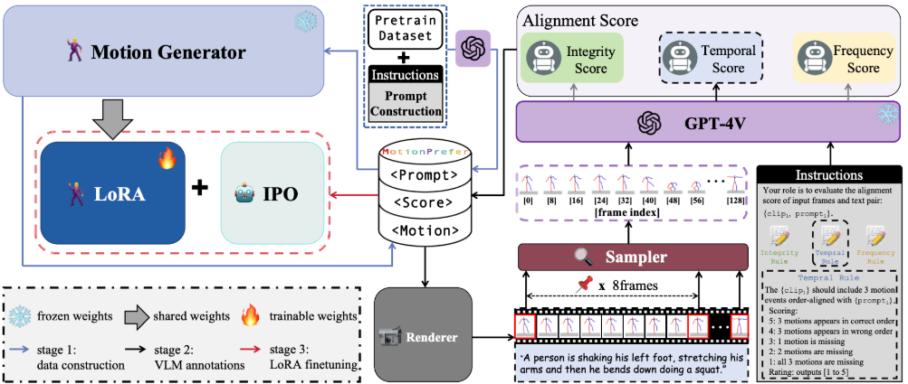

<p align="center">

  <h2 align="center">AToM: Aligning Text-to-Motion Model at Event-Level with GPT-4Vision Reward </h2>
  <p align="center">
    <strong>Haonan Han</strong></a><sup>1*</sup>
    · 
    <strong>Xiangzuo Wu</strong></a><sup>1*</sup>
    · 
    <strong>Huan Liao</strong></a><sup>1*</sup>
    ·
    <strong>Zunnan Xu</strong></a><sup>1</sup>
    ·
    <strong>Zhongyuan Hu</strong></a><sup>1</sup>
    ·
    <br>
    <strong>Ronghui Li</strong></a><sup>1</sup>
    ·
    <strong>Yachao Zhang</strong></a><sup>2†</sup>
    ·
    <strong>Xiu Li</strong></a><sup>1†</sup>
    <br>
    <sup>1</sup>Shenzhen International Graduate School, Tsinghua University  &nbsp;&nbsp;&nbsp; <sup>2</sup>School of Informatics, Xiamen University &nbsp;&nbsp;&nbsp;
    <br>
    </br>
        <a href="https://arxiv.org/pdf/2411.18654"></a> &nbsp; &nbsp;  &nbsp;
<a href="https://atom-motion.github.io/"></a>&nbsp; &nbsp;  &nbsp;
<a href=""></a>
    </br> 


    </br>
   Recently, text-to-motion models have opened new possibilities for creating realistic human motion with greater efficiency and flexibility. However, aligning motion generation with event-level textual descriptions presents unique challenges due to the complex relationship between textual prompts and desired motion outcomes. To address this, we introduce AToM, a framework that enhances the alignment between generated motion and text prompts by leveraging reward from GPT-4Vision. AToM comprises three main stages: Firstly, we construct a dataset MotionPrefer that pairs three types of event-level textual prompts with generated motions, which cover the integrity, temporal relationship and frequency of motion. Secondly, we design a paradigm that utilizes GPT-4Vision for detailed motion annotation, including visual data formatting, task-specific instructions and scoring rules for each sub-task. Finally, we fine-tune an existing text-to-motion model using reinforcement learning guided by this paradigm. Experimental results demonstrate that AToM significantly improves the event-level alignment quality of text-to-motion generation.
  </p>
    </p>
<!-- <div align="center"> -->

## Todo List
- [x] 🪄 Release on arxiv!
- [x] 🪄 Release demo page!
- [x] 🔥 Release the fine-tuned model checkpoints and preference data example.
- [ ] 🔥 Release fine-grained motion preference dataset MotionPrefer including 80K preference pairs.
- [ ] 🔥 Release the instructions for prompt construction and alignment score annotations for different sub-tasks.
- [ ] 🔥 Release more qualitative experimental results.


## Installation

### dataset
Download the HumanML3D dataset from https://github.com/EricGuo5513/HumanML3D, preprocess it according to their instructions, and put it under MotionGPT/datasets/humanml3d

### environment

Our environment is the same as [MotionGPT](https://github.com/OpenMotionLab/MotionGPT) and [InstructMotion](https://github.com/THU-LYJ-Lab/InstructMotion)

```
conda create -n mgpt python=3.10
conda install pytorch==2.0.0 torchvision==0.15.0 torchaudio==2.0.0 pytorch-cuda=11.7 -c pytorch -c nvidia
cd MotionGPT

# if you only need training and testing (no visualization, suggested)
pip install -r requirements_novis.txt

# need visualization (takes longer)
# pip install -r requirements.txt

python -m spacy download en_core_web_sm
bash prepare/download_smpl_model.sh
bash prepare/prepare_t5.sh
bash prepare/download_t2m_evaluators.sh
bash prepare/download_pretrained_models.sh
```


## Inference

Download [weights](https://drive.google.com/drive/folders/1boqS-DyVC-Zsk7iM194YuKinKq8XSH3R?usp=sharing) for MotionGPT-base `motiongpt_s3_h3d.tar` and general-finetuned `general_finetuned.pt`. Note that we only finetuned the t5 model so we still need the pretrained vae in MotionGPT-base. Put them under `MotionGPT/checkpoints/MotionGPT-base/` and `MotionGPT/checkpoints`, respectively.

### reproduce results in the paper

Testing MotionGPT-base: 

```
cd MotionGPT/
python -m test --cfg configs/config_h3d_stage3.yaml --task t2m --checkpoint checkpoints/MotionGPT-base/motiongpt_s3_h3d.tar
```

Testing model finetuned in general (1200 pairs from Frequency, Integrity and Temporal tasks, respectively)

```
cd MotionGPT/
python -m test --cfg configs/config_h3d_stage3.yaml --task t2m --checkpoint [ROOT_PATH]/atom/MotionGPT/checkpoints/general_finetuned.pt --peft --r 8 --lora_alpha 16 --lora_dropout 0.05
```

## Training

### get preference dataset
Download the [preference dataset](https://drive.google.com/file/d/1wV0HtEde7nNHKi0LMhmjhfKjeawWt5wC/view?usp=drive_link) for general task (3600 preference pairs in total).

Put it under the folder `pref_data`, and unzip

### finetune

Train the model on preference dataset:

1. configure ROOT_PATH in commands/dpo_train.sh

2. ```bash commands/dpo_train.sh```


## Preference Dataset Construction (TODO)

1. Download the motion prompts (or construct by yourself)

2. Generate motions given the prompts

3. Render the motions in batch

4. Feed the rendered motions to GPT-4o to get feedback (Caution: may consumes a lot of api-tokens)

5. Construct the preference dataset


## Acknowledgement
We sincerely acknowledge and appreciate the exceptional open-source contributions that form the foundation of our work: [MotionGPT](https://github.com/OpenMotionLab/MotionGPT), [InstructMotion](https://github.com/THU-LYJ-Lab/InstructMotion), [GPT-4V](https://arxiv.org/abs/2303.08774).
## Citation

```
@misc{han2024atomaligningtexttomotionmodel,
      title={AToM: Aligning Text-to-Motion Model at Event-Level with GPT-4Vision Reward}, 
      author={Haonan Han and Xiangzuo Wu and Huan Liao and Zunnan Xu and Zhongyuan Hu and Ronghui Li and Yachao Zhang and Xiu Li},
      year={2024},
      eprint={2411.18654},
      archivePrefix={arXiv},
      primaryClass={cs.CV},
      url={https://arxiv.org/abs/2411.18654}, 
}

```
